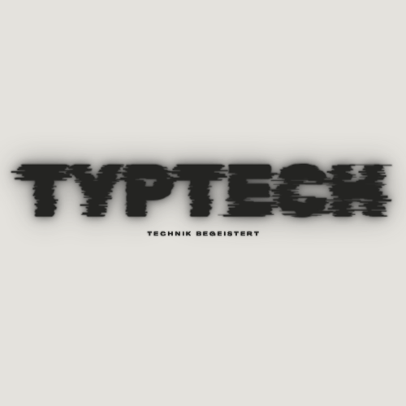

    <h1 style="font-size: 3em; font-weight: bold;">Typtech</h1>
    <a href="https://typtech.de">
        
typtech.de

    </a>

 

 

Name: Thomas/Tom
Wohnort: Bayern, Deutschland 🥨🍺
Programmierung: PHP, CSS, HTML, Python
Projekt: Innovate3D-Labs 
Betriebssysteme: Debian, Ubuntu, Kali, Parrot OS, Windows 10/11
Sprachen: Deutsch, Englisch

 

    <h1 style="font-size: 3em; font-weight: bold;">Repositories</h1>
    
⌨ - KeyLogger (Bald Verfügbar)

    
---

    
---

    
---

 

<h2 id="innovate3d-labs">Innovate3D-Labs</h2>

Hier sind die Details zu meinem Projekt Innovate3D-Labs...

<!--
**TypTech/TypTech** is a ✨ _special_ ✨ repository because its `README.md` (this file) appears on your GitHub profile.

Here are some ideas to get you started:

- 🔭 I’m currently working on ...
- 🌱 I’m currently learning ...
- 👯 I’m looking to collaborate on ...
- 🤔 I’m looking for help with ...
- 💬 Ask me about ...
- 📫 How to reach me: ...
- 😄 Pronouns: ...
- ⚡ Fun fact: ...
-->
